# Modul mahasiswa Lab 06 — Compose: API, PostgreSQL, Redis

**Kebijakan kelas:** Lab ini latihan formatif, tanpa tugas, nilai, atau penyerahan terpisah. Satu proyek besar dikerjakan oleh kelompok **3 orang**, dengan presentasi checkpoint minggu 7 (UTS) dan hasil akhir minggu 14 (UAS). Simpan hasil lab hanya bila berguna sebagai referensi atau bukti proses proyek. Baca [brief proyek kelompok](PROYEK_KELOMPOK.md). Bobot resmi tetap mengikuti RPS/LMS.

**Sesi RPS:** 06 · **Jalur utama:** tiga service Docker Compose lokal · **Prasyarat untuk:** repo Lab 07 setelah praktik ini

## Hasil belajar

Anda dapat membaca [`compose.yaml`](compose.yaml), menjalankan stack tiga service, menjelaskan DNS berbasis nama service, mengamati cache `MISS`/`HIT`, membuktikan persistensi database melalui volume, dan menjalankan profile debug tanpa mengunggah password. API di [`api/app/main.py`](api/app/main.py) memakai PostgreSQL sebagai sumber data dan Redis sebagai cache daftar catatan.

**Teori singkat.** Compose membangun aplikasi dari beberapa service pada network bersama. Service `api` memakai hostname `db` dan `cache` **di dalam** network itu; browser host mengakses API melalui `127.0.0.1:8000`. `depends_on` dengan `service_healthy` menunggu healthcheck dependency sebelum API dimulai. `db_data` dan `redis_data` adalah named volume sehingga data tetap ada ketika container diganti. Secret password dibaca dari file yang dipasang pada `/run/secrets/db_password`.

## Persiapan

Pastikan Docker Desktop/Engine dan Compose plugin berjalan, port host **8000** kosong, serta terminal berada di root repo Lab 06. Hentikan container Lab 05 sebelum memakai port yang sama. Siapkan file lokal berikut; file nyata sudah diabaikan oleh Git.

PowerShell:

```powershell
Copy-Item .\secrets\db_password.txt.example .\secrets\db_password.txt
Copy-Item .\.env.example .\.env
docker compose config --quiet
```

Bash/WSL:

```bash
cp secrets/db_password.txt.example secrets/db_password.txt
cp .env.example .env
docker compose config --quiet
```

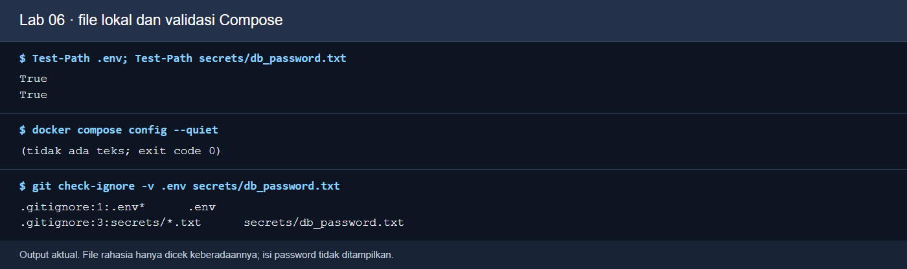

*Perintah: `Test-Path .env`, `Test-Path secrets/db_password.txt`, `docker compose config --quiet`, dan `git check-ignore -v .env secrets/db_password.txt`. Fungsi: membuktikan file lokal ada, Compose dapat membaca YAML, dan Git mengabaikan kredensial. Cara kerja: `config --quiet` menguji konfigurasi tanpa mencetak password; `check-ignore` menunjukkan aturan pengecualian. Baca hasil: dua `True`, exit 0, serta dua aturan `.gitignore`. Ini render output command aktual tanpa menampilkan isi password.*

Jika file lokal sudah ada dari percobaan sebelumnya, jangan menimpa data tanpa memeriksanya. Password contoh hanya untuk laptop latihan; ganti sebelum dipakai di lingkungan lain. Jangan taruh password di laporan atau screenshot.

## Praktik 1 — Menyalakan dan mengamati stack

```bash
docker compose up --build -d --wait
docker compose ps
docker compose logs --tail=30 api db cache
docker compose exec api getent hosts db cache
```

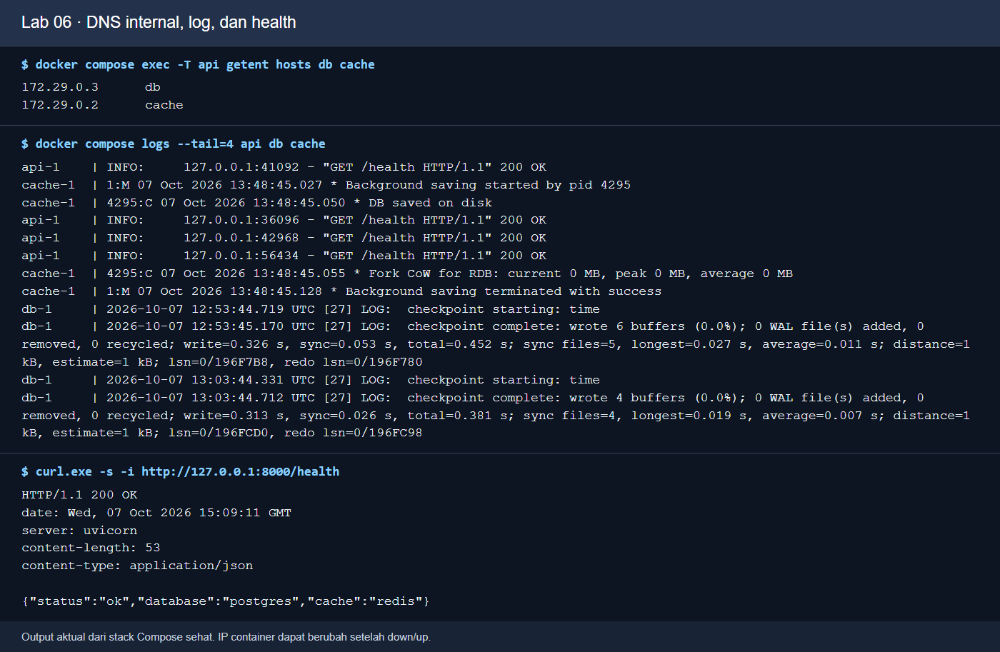

*Perintah: `docker compose exec -T api getent hosts db cache`, `docker compose logs --tail=4 api db cache`, dan `curl.exe -s -i http://127.0.0.1:8000/health`. Fungsi: memeriksa hostname internal, jejak proses, serta respons HTTP. Cara kerja: DNS Compose memberi alamat `db`/`cache` di network internal; API memeriksa kedua dependency pada `/health`. Baca hasil: dua alamat, log service, HTTP 200 dan JSON `status=ok`. Ini render output command aktual; IP container bisa berubah.*

Untuk mengamati log saat permintaan HTTP masuk, jalankan `docker compose logs -f api` di terminal kedua, lalu hentikan mode ikuti log dengan **Ctrl+C**. Ini hanya menghentikan tampilan log, bukan container.

PowerShell: `Invoke-RestMethod http://127.0.0.1:8000/health`; Bash: `curl -fsS http://127.0.0.1:8000/health`.

**Checkpoint A:** `api`, `db`, `cache` sehat; `/health` mengembalikan `status=ok`, `database=postgres`, dan `cache=redis`. Jika status masih `starting`, tunggu healthcheck lalu ulangi. Screenshot ini diambil dari stack lokal yang sedang berjalan.

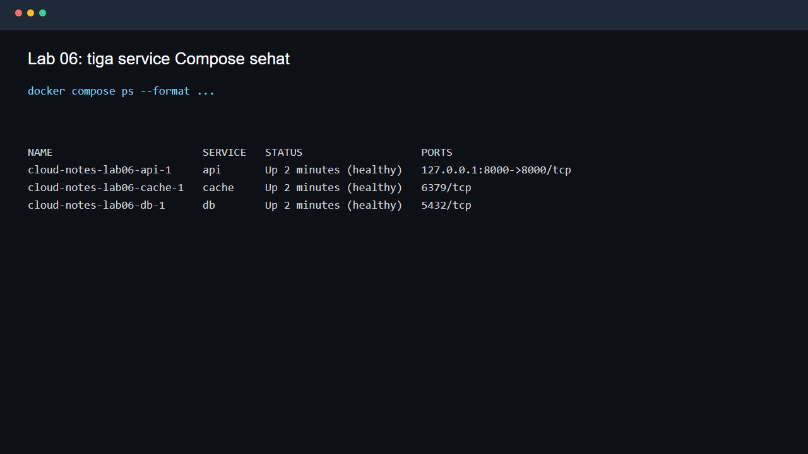

* **Langkah:** Jalankan `docker compose up --build -d --wait` lalu `docker compose ps` dari root repo Lab 06. **Fungsi:** Memeriksa prasyarat API, PostgreSQL, dan Redis sebelum demo catatan. **Cara kerja:** Compose membangun/menjalankan service, jaringan, volume, dan healthcheck; API bergantung pada DB/cache, sedangkan `--wait` menunggu semuanya siap. **Baca hasil:** Cari tiga service `healthy` dan port API 8000.

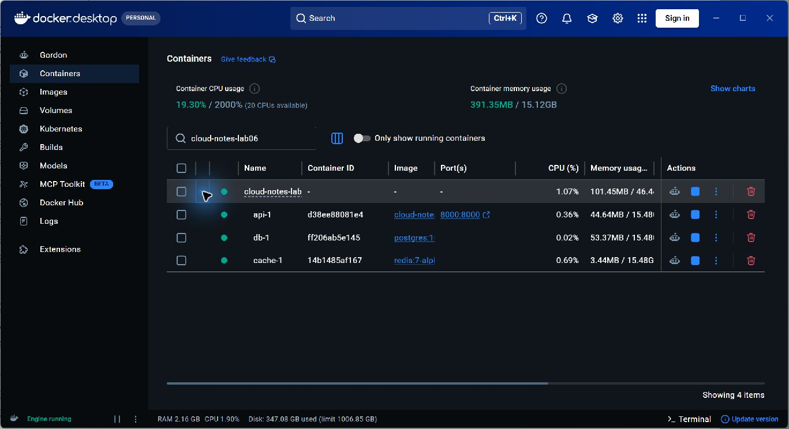

* **Langkah:** Setelah `docker compose up --build -d --wait`, buka Docker Desktop > Containers dan cari project `cloud-notes-lab06`; bandingkan dengan `docker compose ps`. **Fungsi:** Memastikan tiga proses layanan benar-benar aktif secara visual. **Cara kerja:** Compose membuat container `api`, `db`, dan `cache` pada jaringan internal; hanya API memetakan port host `127.0.0.1:8000`. **Baca hasil:** Tiga titik hijau berarti container berjalan; cek tulisan `healthy` pada terminal untuk status healthcheck. DB 5432 dan Redis 6379 tidak diekspos ke host.*

*Gambar: `docker compose ps` dari stack lokal; tiga baris sehat menunjukkan API baru dimulai setelah database dan cache siap.*

Buka `http://127.0.0.1:8000/docs` untuk melihat endpoint API versi **0.6**. Bandingkan dengan Lab 05: endpoint DELETE tersedia dan data catatan kini berasal dari PostgreSQL.

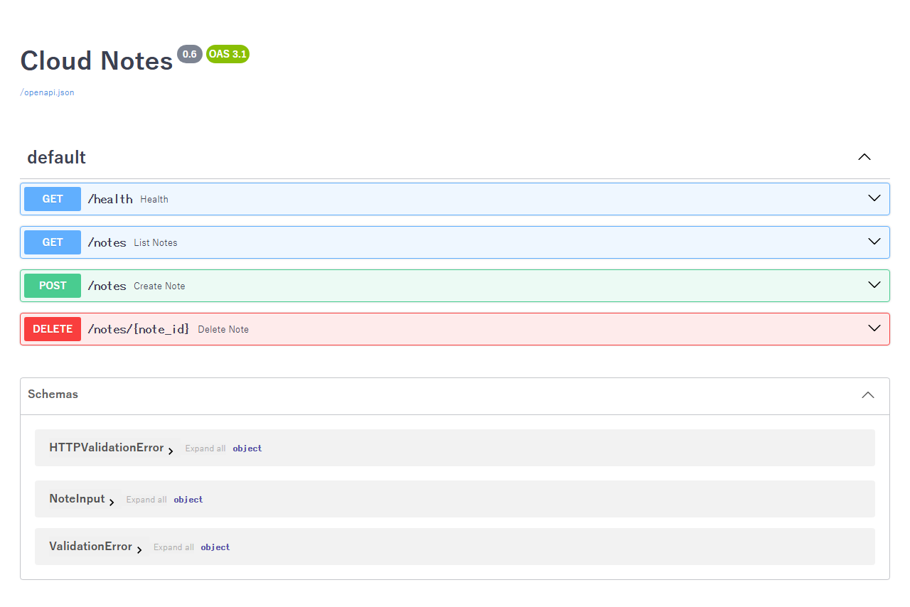

* **Langkah:** Buka `http://127.0.0.1:8000/docs` setelah Compose sehat. **Fungsi:** Mengenali endpoint API versi Lab 06 yang memakai PostgreSQL dan Redis. **Cara kerja:** FastAPI menyajikan Swagger UI dari OpenAPI service `api` di stack Compose. **Baca hasil:** Cari `/health`, `/notes`, dan metode DELETE; uji GET health tanpa mengubah data.

*Gambar: halaman Swagger dari API Compose yang benar-benar berjalan; gunakan GET `/health` untuk mencoba respons tanpa mengubah data.*

## Praktik 2 — Cache dan database

PowerShell:

```powershell
$body = '{"title":"Compose","content":"Catatan saya bertahan di PostgreSQL"}'
Invoke-RestMethod http://127.0.0.1:8000/notes -Method Post -ContentType application/json -Body $body
(Invoke-WebRequest http://127.0.0.1:8000/notes -UseBasicParsing).Headers['X-Cache']
(Invoke-WebRequest http://127.0.0.1:8000/notes -UseBasicParsing).Headers['X-Cache']
```

Bash/WSL:

```bash
curl -fsS -X POST http://127.0.0.1:8000/notes -H 'Content-Type: application/json' -d '{"title":"Compose","content":"Catatan saya bertahan di PostgreSQL"}'
curl -i http://127.0.0.1:8000/notes
curl -i http://127.0.0.1:8000/notes
```

**Checkpoint B:** header `X-Cache` bernilai `MISS`, lalu `HIT` jika panggilan kedua dilakukan dalam TTL 30 detik. POST berikutnya menghapus cache daftar sehingga GET selanjutnya kembali `MISS`. Jika lebih dari 30 detik berlalu, ulangi dua GET dengan cepat. Bukti contoh:

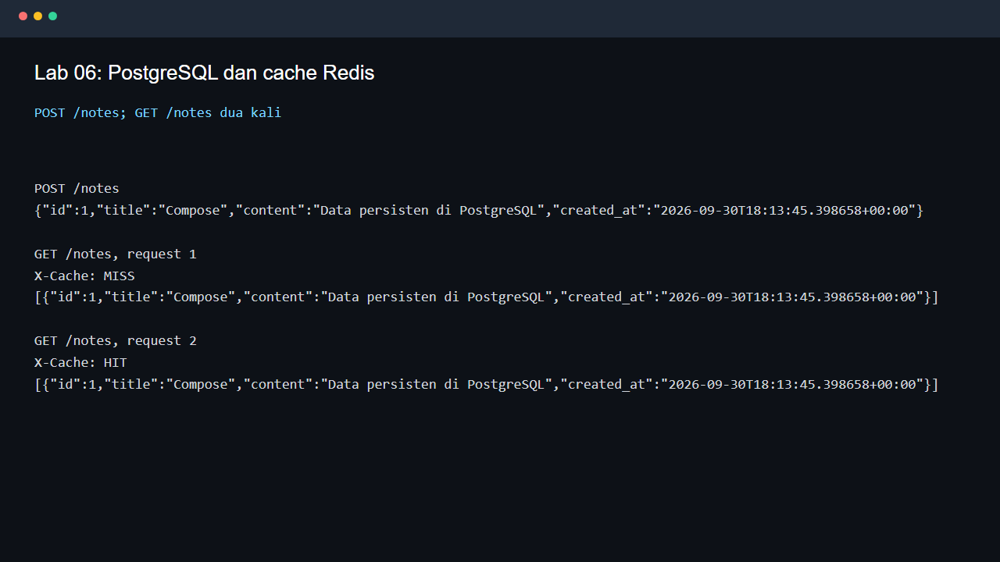

* **Langkah:** Setelah POST catatan, panggil GET `/notes` dua kali berturut-turut dengan `curl -i`. **Fungsi:** Mengamati cache Redis pada request baca. **Cara kerja:** GET pertama mengambil PostgreSQL dan mengisi cache; GET kedua membaca cache sampai TTL habis. **Baca hasil:** Bandingkan header `X-Cache: MISS` lalu `X-Cache: HIT` dengan isi catatan yang tetap sama.

Periksa isi database dan coba restart API:

```bash
docker compose exec db psql -U clouduser -d cloudnotes -c 'SELECT id, title FROM notes;'
docker compose restart api
docker compose ps
```

Setelah API sehat lagi, PowerShell: `Invoke-RestMethod http://127.0.0.1:8000/notes`; Bash: `curl -fsS http://127.0.0.1:8000/notes`. **Checkpoint C:** catatan masih ada sesudah `restart api`.

Untuk menguji named volume lebih kuat, hentikan lalu hidupkan ulang stack:

```bash
docker compose --profile debug down
docker compose up -d --wait
docker compose exec db psql -U clouduser -d cloudnotes -c 'SELECT id, title FROM notes;'
```

**Checkpoint D:** catatan masih ada karena `down` tidak menghapus named volume. Jangan gunakan `down -v` selama data latihan masih diperlukan. Bila Anda lanjut ke Lab 07, biarkan stack menyala.

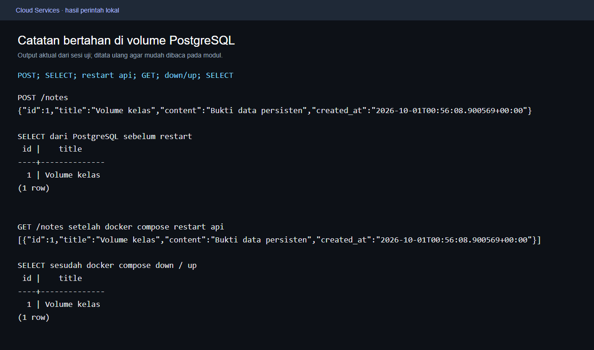

* **Langkah:** POST catatan, query `SELECT id,title FROM notes`, `docker compose restart api`, lalu `down`/`up` dan query lagi. **Fungsi:** Menguji persistensi data lintas restart API dan stack. **Cara kerja:** PostgreSQL menulis ke volume Compose; restart proses API tidak menghapus volume. **Baca hasil:** Cocokkan ID/judul catatan sebelum dan sesudah; `down -v` baru menghapus volume latihan.

*Gambar: output POST, query PostgreSQL, restart API, dan down/up yang benar-benar dijalankan. ID, judul, dan timestamp pada pekerjaan Anda dapat berbeda.*

## Profile debug dan analisis

Opsional, jalankan `docker compose --profile debug up -d adminer`, lalu buka `http://127.0.0.1:8081`. Pilih PostgreSQL; server `db`, pengguna `clouduser`, database `cloudnotes`, dan password dari file lokal. Jangan tampilkan password di screenshot. Adminer hanya perlu untuk pemeriksaan manual dan memakai port 8081.

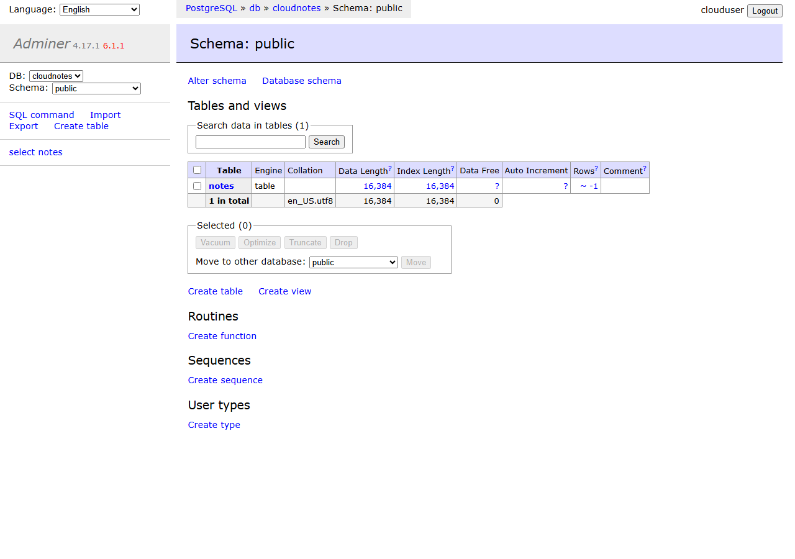

* **Langkah:** Jalankan `docker compose --profile debug up -d adminer`, buka port 8081, lalu login dengan akun lab. **Fungsi:** Melihat database lewat UI SQL tanpa mengubah service utama. **Cara kerja:** Adminer pada profile `debug` tersambung ke PostgreSQL lewat jaringan Compose. **Baca hasil:** Periksa nama database `cloudnotes` dan tabel `notes`; jangan tampilkan password pada bukti.

*Gambar: tampilan Adminer dari service profile `debug` setelah login. Password tidak terlihat; pilih tabel `notes` untuk memeriksa catatan.*

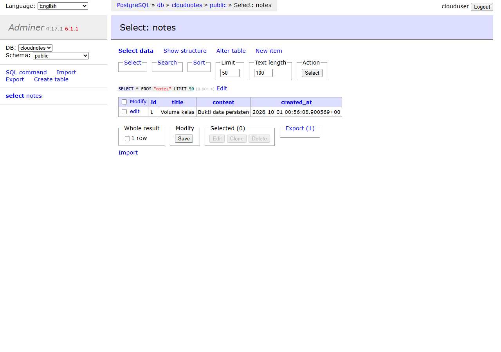

* **Langkah:** Di Adminer, pilih tabel `notes` lalu klik **Select data**. **Fungsi:** Membandingkan data database dengan respons API. **Cara kerja:** Adminer mengirim query SELECT ke PostgreSQL yang sama dengan sumber API. **Baca hasil:** Cocokkan ID/judul dengan hasil GET `/notes`; hindari tombol Truncate atau Drop.

*Gambar: data yang sama seperti respons API tampil di PostgreSQL. Jangan gunakan tombol `Truncate`/`Drop` pada data yang masih diperlukan.*

Jawab dalam laporan:

1. Mengapa kode API memakai `DB_HOST=db`, sedangkan browser memakai `127.0.0.1`?
2. Bukti apa yang membedakan hasil `restart api`, `down`, dan `down -v`? Jelaskan tanpa menjalankan `-v` bila data masih dipakai.
3. Apa hubungan POST, invalidasi cache, `MISS`, `HIT`, dan TTL 30 detik?
4. Apa yang terjadi bila `db` sehat tetapi `cache` belum sehat? Apa fungsi `depends_on` di konfigurasi ini?
5. Mengapa `.env.example` boleh ada di Git, sedangkan `.env` dan file password nyata harus tetap lokal?

Dari root repo, salin [template laporan](hasil/TEMPLATE_LAPORAN.md) ke `hasil/lab06.md`: PowerShell `Copy-Item hasil/TEMPLATE_LAPORAN.md hasil/lab06.md`; Bash `cp hasil/TEMPLATE_LAPORAN.md hasil/lab06.md`. Sertakan screenshot **hasil Anda** di `hasil/bukti/`, hasil SQL tanpa password, dan penjelasan. Screenshot modul bukan bukti mahasiswa.

## Git dan pembersihan

Jika Lab 07 akan segera dilakukan, biarkan stack hidup. Setelah selesai, dari root repo Lab 06 jalankan:

```bash
docker compose --profile debug down
```

Perintah ini juga menghentikan Adminer bila profile `debug` sempat aktif; volume tetap tersimpan. Hanya pada data latihan yang boleh dihapus, `docker compose --profile debug down -v` juga menghapus volume.

Dari root repo, ikuti [panduan Git](PANDUAN_GIT.md):

```bash
git status --short
git check-ignore -v .env secrets/db_password.txt
git add compose.yaml api initdb secrets .env.example MODUL_MAHASISWA.md hasil/lab06.md hasil/bukti
git diff --cached --name-only
git diff --cached --check
git commit -m "lab06: Compose, cache, dan persistensi"
git push
```

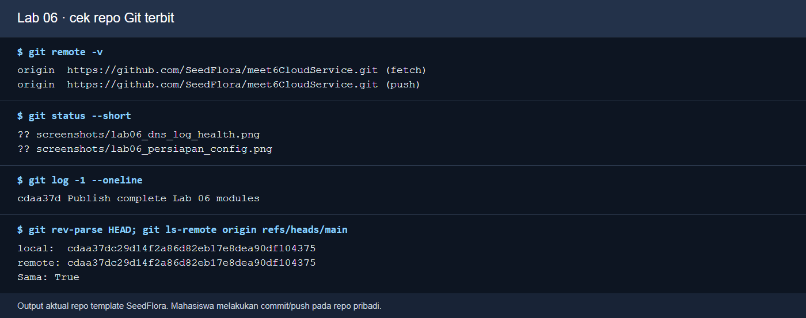

*SHA pada gambar adalah snapshot saat uji. Setelah modul diperbarui, jalankan ulang perintah untuk memeriksa commit terbaru.*

*Perintah: `git remote -v`, `git status --short`, `git log -1 --oneline`, `git rev-parse HEAD`, dan `git ls-remote origin refs/heads/main`. Fungsi: memeriksa tujuan serta hasil push modul dan kode. Cara kerja: cocokkan SHA lokal dengan branch `main` remote. Baca hasil: `Sama: True` pada repo pengajar; mahasiswa mengulangi pada repo pribadi setelah commit/push. Ini render output command aktual.*

Jika folder bukti belum dibuat, hilangkan argumen tersebut. Sebelum commit, pastikan `.env` dan `secrets/db_password.txt` **tidak** staged; contoh `.env.example` dan `db_password.txt.example` boleh staged. Jika push pertama belum punya upstream, gunakan `git push -u origin main`.

**Jika gagal:** konflik port 8000 berarti API Lab 05 masih aktif. `DB password authentication failed` dapat terjadi bila password file diubah sementara volume lama menyimpan kredensial awal; gunakan password awal untuk volume itu atau minta dosen membantu reset data latihan. `X-Cache` dua kali `MISS` dapat terjadi bila jaraknya melewati TTL. Jalankan `docker compose logs --tail=50 api db cache` untuk membaca sebab, tanpa membagikan secret.

**Pilihan cloud:** stack utama ini memang untuk Docker lokal; deployment publik memerlukan desain jaringan, secret manager, dan layanan database/cache tersendiri. Tidak diperlukan untuk menyelesaikan checkpoint Lab 06.

## Kunci tantangan: cache Redis berhenti saat layanan dipakai

**Kasus kerja:** operasi menerima laporan bahwa fitur daftar catatan lambat, tetapi data tidak boleh hilang. Tugas Anda membedakan gangguan cache dari gangguan database dan memulihkan service. Kunci berikut memakai stack Lab 06 yang sudah sehat dan berisi sedikitnya satu catatan. Jalankan di **root repo Lab 06**; jangan memakai `down -v` karena Lab 07 dapat menggunakan volume yang sama.

### 1. Catat keadaan sehat

PowerShell:

```powershell
docker compose ps
Invoke-RestMethod http://127.0.0.1:8000/health
(Invoke-WebRequest http://127.0.0.1:8000/notes -UseBasicParsing).Headers['X-Cache']
```

Bash:

```bash
docker compose ps
curl -i http://127.0.0.1:8000/health
curl -i http://127.0.0.1:8000/notes
```

`/health` memeriksa PostgreSQL dan Redis. `X-Cache` mungkin `MISS` atau `HIT` tergantung request sebelumnya; keduanya normal pada keadaan sehat.

### 2. Simulasikan cache mati dan baca gejala

```bash
docker compose stop cache
docker compose ps
docker compose logs --tail=20 api cache
```

PowerShell:

```powershell
try { Invoke-WebRequest http://127.0.0.1:8000/health -UseBasicParsing } catch { [int]$_.Exception.Response.StatusCode }
$r = Invoke-WebRequest http://127.0.0.1:8000/notes -UseBasicParsing
$r.StatusCode
$r.Headers['X-Cache']
$r.Content
```

Bash:

```bash
curl -s -o /dev/null -w '%{http_code}\n' http://127.0.0.1:8000/health
curl -i http://127.0.0.1:8000/notes
```

**Hasil kunci:** health menjadi **503** karena dependency cache tidak sehat. GET `/notes` tetap **200** dan memberi `X-Cache: MISS` karena kode memakai PostgreSQL sebagai sumber kebenaran jika Redis gagal. Request bisa melambat beberapa detik saat koneksi Redis gagal; pada uji lokal sekitar **4 detik**. Catatan tetap ada. Periksa `docker compose exec db psql -U clouduser -d cloudnotes -c 'SELECT id,title FROM notes;'` bila perlu membuktikan data di database.

### 3. Pulihkan cache

```bash
docker compose start cache
docker compose ps
```

Tunggu cache sehat. Di PowerShell, jalankan berurutan `Invoke-RestMethod http://127.0.0.1:8000/health` dan dua kali `(Invoke-WebRequest http://127.0.0.1:8000/notes -UseBasicParsing).Headers['X-Cache']`. Di Bash, gunakan `curl -i` untuk URL yang sama. Health kembali **200**; GET pertama setelah pemulihan biasanya `MISS` dan kedua `HIT` bila kurang dari TTL 30 detik. `docker compose restart api` dapat dipakai bila status health API belum pulih; ulangi sampai `api` healthy. Rekam `docker compose ps` serta kode HTTP sebelum/sesudah ke `hasil/lab06.md`.

### Bonus — kunci cache berisi JSON rusak

Pada cache latihan milik stack ini saja, Anda dapat mensimulasikan entri daftar yang rusak. Jalankan saat semua service sehat:

```bash
docker compose exec -T cache redis-cli SET notes:list '{broken'
```

Lalu panggil GET `/notes` dua kali cepat dengan perintah dari bagian sebelumnya. **Hasil kunci:** GET pertama tetap HTTP **200/MISS** dan membaca PostgreSQL; API membuang salinan cache yang tidak dapat diparse lalu mengisi cache baru. GET kedua HTTP **200/HIT**. `/health` tetap 200 karena Redis hidup; masalahnya adalah **isi cache**, bukan koneksi. Pada uji lokal kasus ini lulus dan catatan ID 1 tetap ada. Jangan uji ini pada Redis aplikasi lain.

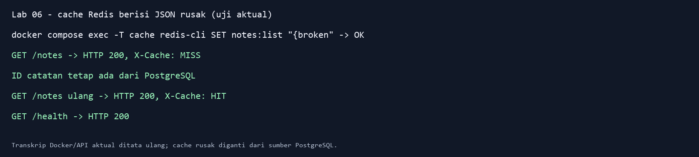

*Perintah: `docker compose exec -T cache redis-cli SET notes:list '{broken'`, lalu GET `/notes` dua kali. Gambar adalah transkrip output aktual yang ditata agar terbaca. Baris MISS membuktikan fallback ke database; HIT berikutnya membuktikan cache berhasil diisi ulang.*

### 4. Kunci pertanyaan analisis

1. Nama `db` dan `cache` diterjemahkan oleh DNS jaringan Compose antar-container. Browser berada di host sehingga mengakses port API yang dipublish pada `127.0.0.1:8000`.
2. `restart api` mengganti proses API, bukan volume. `down` menghapus container/jaringan tetapi mempertahankan named volume. `down -v` juga menghapus named volume; gunakan hanya untuk data latihan yang memang boleh dibuang.
3. POST menyimpan catatan di PostgreSQL dan menghapus cache daftar. GET pertama membaca database dan memberi `MISS`, lalu mengisi Redis selama 30 detik. GET berikutnya membaca cache (`HIT`) sampai TTL habis atau POST/DELETE berikutnya membatalkannya.
4. `depends_on: condition: service_healthy` menunda start API sampai DB dan cache sehat pada awal `up`; setelah stack berjalan, Compose tidak otomatis memulihkan proses API saat dependency tiba-tiba gagal. Health API dapat menjadi 503 saat cache mati, tetapi GET daftar masih punya jalur database.
5. `.env.example` dan file secret `.example` adalah template tanpa kredensial produksi. `.env` serta `secrets/db_password.txt` berisi nilai lokal dan sudah diabaikan Git; cek dengan `git check-ignore -v .env secrets/db_password.txt` sebelum commit.

### 5. Kunci cek Docker dan Git

`docker compose ps` menampilkan tiga service utama dalam kondisi healthy dan port API host 8000. `docker compose exec api getent hosts db cache` membuktikan service name dapat di-resolve di network internal. `docker compose exec db psql ...` membuktikan catatan ada di database. `git diff --cached --name-only` harus memperlihatkan kode, modul, dan laporan yang dipilih, tanpa password nyata. Sesudah demo, jalankan `docker compose --profile debug down` hanya bila Lab 07 tidak segera memakai stack ini.

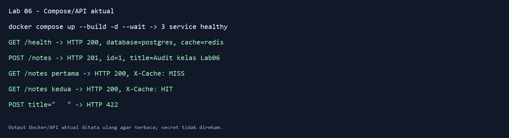

*Perintah: `docker compose up --build -d --wait`, POST satu catatan, lalu GET `/notes` dua kali. Cuplikan Docker/API aktual ditata agar terbaca: API, DB, dan Redis healthy; POST HTTP 201; header `X-Cache` berubah dari MISS ke HIT; judul hanya spasi ditolak HTTP 422.*

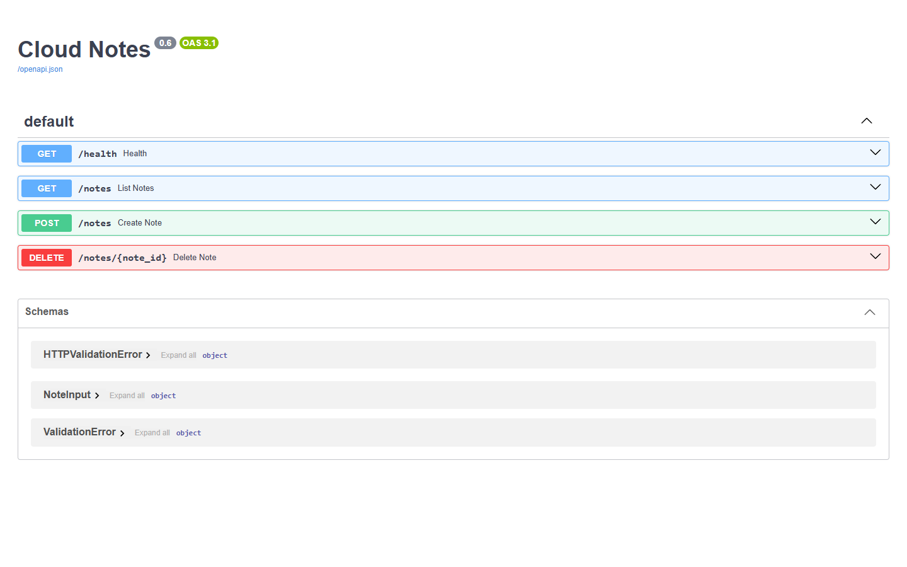

*Perintah: buka `http://127.0.0.1:8000/docs` ketika `docker compose ps` sehat. Browser memuat Swagger UI dari API Compose, termasuk `DELETE /notes/{note_id}`. Gunakan ini untuk membandingkan kontrak API persisten dengan Lab 05.*

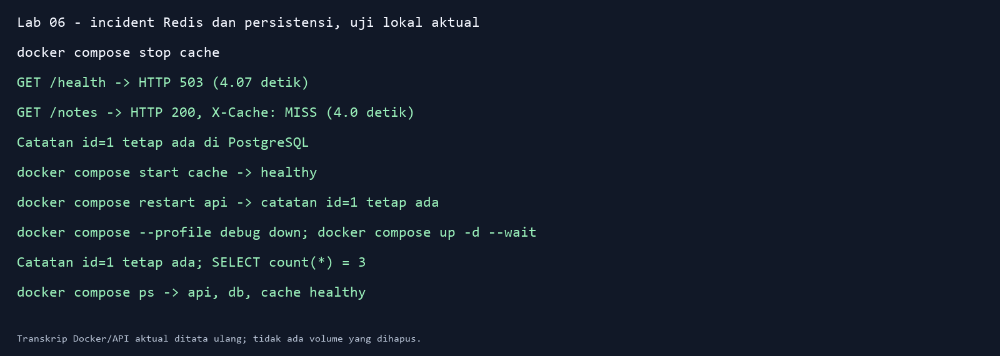

*Perintah: `docker compose stop cache`, GET `/health` dan `/notes`, pulihkan cache, lalu `docker compose restart api` serta `docker compose --profile debug down`/`docker compose up -d --wait`. Gambar adalah transkrip Docker/API aktual yang ditata agar terbaca. Kode 503 menandai cache tidak sehat; GET tetap 200/MISS; ID catatan sama setelah restart dan down/up karena volume PostgreSQL tetap ada. Jangan menambah `-v` pada cleanup sebelum data latihan boleh dihapus.*
